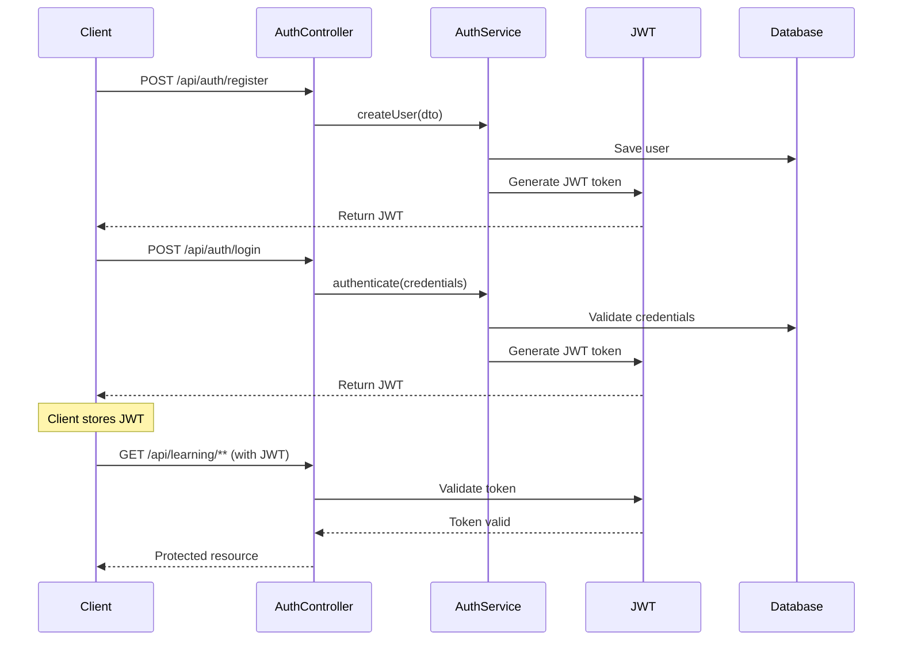
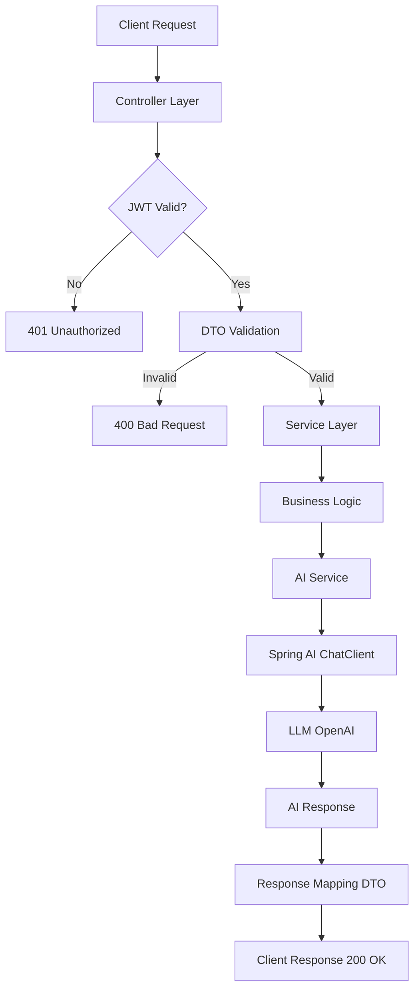
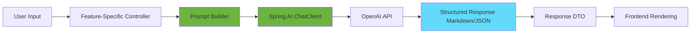
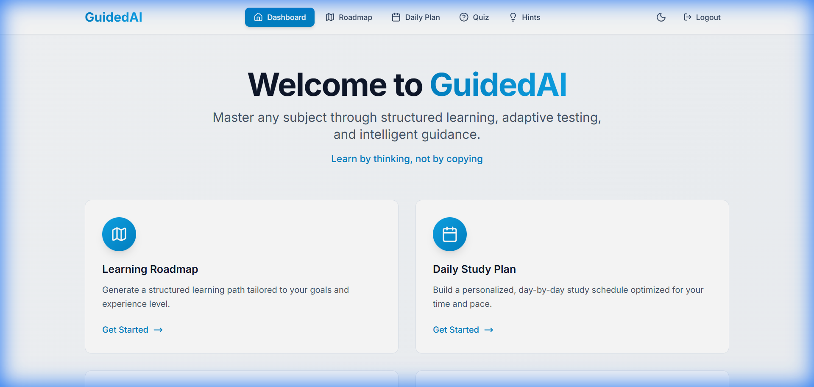
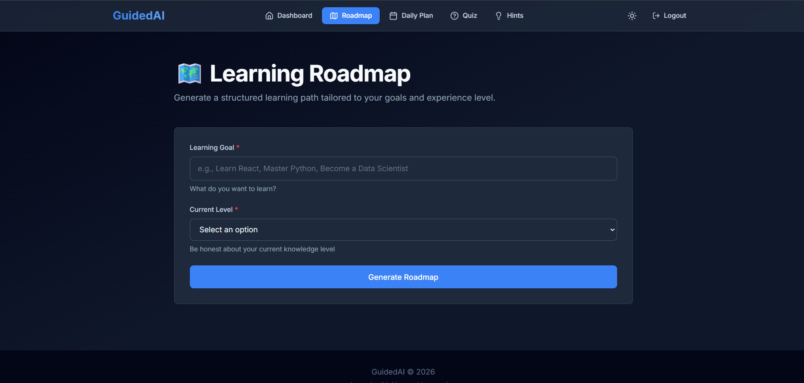
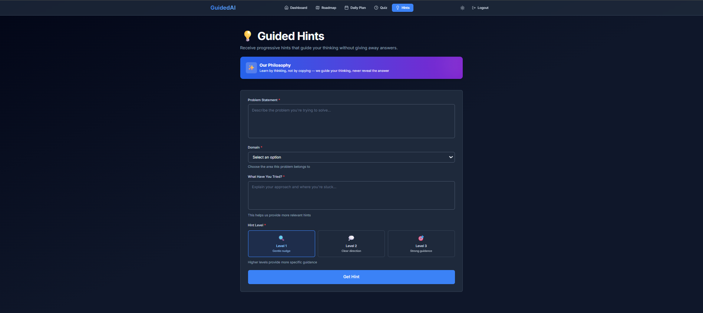

<div align="center">

# 🚀 GuidedAI

### AI-Powered Learning Platform

**"Learn by thinking, not by copying"**

[](https://spring.io/projects/spring-boot)
[](https://spring.io/projects/spring-ai)
[](https://reactjs.org/)
[](https://www.typescriptlang.org/)
[](https://tailwindcss.com/)
[](https://www.postgresql.org/)

[Demo Video](#-demo) • [Features](#-features) • [Architecture](#-backend-architecture) • [Setup](#-quick-start)

</div>

---

## 🎯 The Problem

Most AI learning tools today suffer from fundamental flaws:

- **Information Overload**: Dumping excessive content without structure
- **Answer Dependency**: Directly providing solutions, preventing real learning
- **Domain Limitation**: Focused only on programming, ignoring other subjects
- **Passive Learning**: Students copy-paste instead of thinking

## 💡 Our Solution

**GuidedAI** is a production-grade AI learning platform that emphasizes **active thinking over passive memorization**. Built on a philosophy of guidance rather than spoon-feeding, it provides:

✅ **Structured Learning Paths** (AI Roadmaps)  
✅ **Realistic Daily Study Plans**  
✅ **Interactive Practice Quizzes**  
✅ **Socratic AI Hints** (Never direct answers)

Unlike typical ChatGPT wrappers, GuidedAI is a **thoughtfully architected system** with clean backend design, purposeful AI integration, and production-ready patterns.

---

## 🌐 Demo

🎥 **Watch the Demo**: [GuidedAI Platform Walkthrough](https://www.youtube.com/watch?v=PRO2pu42XJU)

🌍 **Live Frontend**: *(Coming soon)*

🔌 **Backend API**: `http://localhost:8080`

📚 **API Documentation**: Navigate to `/swagger-ui/index.html` after starting the backend

---

## ✨ Features

### 🗺️ 1. AI Roadmap Generator

<details>
<summary><b>Click to expand</b></summary>

- Generates personalized, **phase-wise learning roadmaps**
- Adapts to user's **goal and experience level** (Beginner/Intermediate/Advanced)
- Structured output in **Markdown** (beautifully rendered in frontend)
- Removes the "where do I start?" paralysis

**API Endpoint**: `POST /roadmap`

</details>

### 📅 2. Daily Study Plan Generator

<details>
<summary><b>Click to expand</b></summary>

- Creates **day-by-day learning schedules**
- Considers:
  - Learning goal
  - Skill level
  - Number of days
  - Daily available hours
- Designed for **consistency and realistic pacing**

**API Endpoint**: `POST /daily-plan`

</details>

### 📝 3. AI Quiz Generator

<details>
<summary><b>Click to expand</b></summary>

- **Dynamically generated MCQs** on any topic
- Configurable difficulty levels
- Questions delivered **one at a time** (no cognitive overload)
- Immediate feedback with **correct/incorrect highlighting**
- Real-time **score tracking**

**API Endpoint**: `POST /quiz`

</details>

### 💡 4. AI Intuition (Hints) — **USP**

<details>
<summary><b>Click to expand</b></summary>

> **"We don't give answers. We guide you to think."**

This is GuidedAI's **key differentiator**:

- Provides **Socratic hints**, never full solutions
- Three progressive hint levels (1 → 2 → 3)
  - Level 1: Subtle nudge
  - Level 2: More direction
  - Level 3: Strong guidance (but still no direct answer)
- Supports multiple domains:
  - Data Structures & Algorithms
  - System Design
  - Mathematics
  - Programming Languages
  - General Logic
- **Context-aware**: Considers what the student has already tried

**API Endpoint**: `POST /intuition/hint`

</details>

---

## 🏗️ Backend Architecture

> **This project is backend-focused**, emphasizing clean architecture, AI integration, and production-ready patterns.

### 🛠️ Tech Stack

| Component | Technology |
|-----------|-----------|
| **Framework** | Spring Boot 4.0 |
| **AI Integration** | Spring AI 2.0 |
| **Language** | Java 21 |
| **Security** | Spring Security + JWT |
| **Database** | PostgreSQL |
| **ORM** | Hibernate / JPA |
| **Validation** | Spring Validation |
| **Mapping** | MapStruct |
| **API Docs** | SpringDoc OpenAPI (Swagger) |
| **LLM Provider** | OpenRouter (Gemini) |

---

### 🔐 Authentication Flow

> **Note**: Mermaid diagrams render on GitHub. If not visible, view the [text description](#backend-system-flow) below.



---

### 🔄 Backend System Flow

#### **High-Level Request Flow**



**Key Layers:**

1. **Controller Layer**: REST endpoints, request validation
2. **Service Layer**: Business logic, orchestration
3. **AI Service**: Prompt engineering, LLM communication
4. **Persistence Layer**: JPA repositories (for user management)

---

### 🤖 AI Integration Flow



**Key Points:**

- ✅ **Strict Prompts**: Each feature has dedicated prompt builders (prevent misuse)
- ✅ **Controlled AI**: Not free-form chat — purposeful, structured responses
- ✅ **Context-Aware**: Prompts include user level, domain, previous attempts
- ✅ **Format Enforcement**: AI responses return Markdown or JSON as required

---

### 📁 Backend Project Structure

```
com.ai.education.platform/
├── auth/                  # JWT authentication & authorization
│   ├── AuthController.java
│   ├── AuthService.java
│   └── JwtUtil.java
├── user/                  # User entity & repository
│   ├── User.java
│   ├── UserRepository.java
│   └── UserService.java
├── learning/              # Core learning features
│   ├── roadmap/
│   │   ├── RoadmapController.java
│   │   ├── RoadmapService.java
│   │   └── RoadmapDTO.java
│   ├── dailyplan/
│   │   ├── DailyPlanController.java
│   │   └── DailyPlanService.java
│   ├── quiz/
│   │   ├── QuizController.java
│   │   └── QuizService.java
│   └── intuition/
│       ├── IntuitionController.java
│       └── IntuitionService.java
├── ai/                    # AI integration layer
│   ├── AIService.java
│   ├── PromptBuilder.java
│   └── LLMConfig.java
├── config/                # Configuration classes
│   ├── SecurityConfig.java
│   ├── SwaggerConfig.java
│   └── CorsConfig.java
├── exception/             # Global exception handling
│   ├── GlobalExceptionHandler.java
│   └── CustomExceptions.java
└── util/                  # Shared utilities
    └── ResponseWrapper.java
```

---

### 🧪 Backend Validation & Error Handling

✅ **DTO-Level Validation**: `@Valid` annotations with `@NotBlank`, `@Size`, `@Email`  
✅ **Centralized Exception Handling**: `@ControllerAdvice` with `@ExceptionHandler`  
✅ **Clean API Errors**: Consistent JSON error responses  
✅ **Enum Validation**: Strict validation for `LearningLevel`, `Domain`, `HintLevel`  

**Example Error Response:**
```json
{
  "timestamp": "2024-02-10T19:30:00",
  "status": 400,
  "error": "Bad Request",
  "message": "Goal cannot be empty",
  "path": "/api/learning/roadmap"
}
```

---

## 🖥️ Frontend Overview

> Clean, modern interface built with React + TypeScript + Tailwind CSS. Dark mode by default, glassmorphism design, responsive layout.

**Tech Stack**: React 19 | TypeScript 5.9 | Tailwind CSS 3.4 | Vite 7 | React Router | Axios

---

## 🚀 Quick Start

### Prerequisites

- **Backend**:
  - Java 21
  - Maven 3.x
  - PostgreSQL (running instance)
- **Frontend**:
  - Node.js 18+
  - npm or yarn

---

### 🗄️ Database Setup

1. **Create PostgreSQL Database**:
   ```sql
   CREATE DATABASE guided_ai;
   CREATE USER guided_user WITH PASSWORD 'your_password';
   GRANT ALL PRIVILEGES ON DATABASE guided_ai TO guided_user;
   ```

2. **Configure Backend** (`ai-learning-platform/src/main/resources/application.properties`):
   ```properties
   spring.datasource.url=jdbc:postgresql://localhost:5432/guided_ai
   spring.datasource.username=guided_user
   spring.datasource.password=your_password
   
   # OpenAI API Key
   spring.ai.openai.api-key=your-openai-api-key
   
   # JWT Secret
   jwt.secret=your-jwt-secret-key-min-256-bits
   ```

---

### ▶️ Running the Backend

```bash
cd ai-learning-platform
mvn clean install
mvn spring-boot:run
```

Backend will start on: **http://localhost:8080**

**Swagger UI**: Navigate to http://localhost:8080/swagger-ui/index.html

---

### ▶️ Running the Frontend

```bash
cd frontend
npm install
npm run dev
```

Frontend will start on: **http://localhost:5173**

---

### 🧪 Test the Application

1. **Register a new user** at `/register`
2. **Login** at `/login`
3. Navigate to the **Dashboard**
4. Try each feature:
   - Generate a roadmap
   - Create a daily plan
   - Take a quiz
   - Get an AI hint

---

## 📸 Screenshots

### Dashboard


### AI Roadmap Generator


### AI Intuition (Hints)


> *Screenshots will be added here*

---

## 🧠 Core Philosophy

> **"AI should guide thinking, not replace it."**

GuidedAI **guides** learners to think (Socratic hints), **structures** learning (roadmaps, plans), and **reinforces** understanding (quizzes) — without spoon-feeding answers or enabling shortcuts.  

---

## 🚧 Pending / Future Roadmap

**The project is intentionally designed to evolve. This is not a "hackathon throwaway" — it's a foundation for a real product.**

### Post-Hackathon Development Plans:

#### ☁️ **Deployment**
- [ ] Deploy backend on Railway/Render/AWS
- [ ] Deploy frontend on Vercel/Netlify
- [ ] Set up CI/CD pipeline

#### 🧠 **Enhanced Personalization**
- [ ] AI recommendations based on learning history
- [ ] Adaptive difficulty (learns from user performance)
- [ ] Personalized study reminders

#### 📊 **Progress Tracking**
- [ ] User dashboard with learning analytics
- [ ] Saved roadmaps, plans, and quiz history
- [ ] Streak tracking and gamification (minimal, non-distracting)

#### 🎯 **Expanded AI Intuition**
- [ ] Multi-turn hint conversations
- [ ] Domain-specific hint strategies
- [ ] Integration with code execution (for programming hints)

#### 🔐 **Additional Features**
- [ ] Role-based access control (Student, Mentor, Admin)
- [ ] Social learning (study groups, shared roadmaps)
- [ ] Integration with learning resources (MDN, freeCodeCamp, etc.)

#### 🧪 **Quality & Testing**
- [ ] Unit tests for backend services
- [ ] Integration tests for API endpoints
- [ ] Frontend component tests
- [ ] E2E testing with Playwright

#### 📦 **DevOps**
- [ ] Docker containerization
- [ ] Basic monitoring and logging

---

## 🔒 Security Features

✅ **JWT Authentication**: Stateless token-based auth  
✅ **Password Hashing**: BCrypt encryption  
✅ **CORS Configuration**: Controlled cross-origin requests  
✅ **Input Validation**: Prevents injection attacks  
✅ **Rate Limiting**: (Planned for production)  

---

## 📝 API Endpoints

### **Authentication**
| Method | Endpoint | Description |
|--------|----------|-------------|
| POST | `/api/auth/register` | Create new user account |
| POST | `/api/auth/login` | Authenticate and get JWT |

### **Learning Features** (Protected)
| Method | Endpoint | Description |
|--------|----------|-------------|
| POST | `/roadmap` | Generate AI learning roadmap |
| POST | `/daily-plan` | Generate daily study plan |
| POST | `/quiz` | Generate AI quiz |
| POST | `/intuition/hint` | Get Socratic AI hint |

📚 **Full API Documentation**: Available at `/swagger-ui/index.html`

---

## 🤝 Contributing

This is a hackathon project, but contributions are welcome for post-hackathon development!

1. Fork the repository
2. Create a feature branch (`git checkout -b feature/amazing-feature`)
3. Commit your changes (`git commit -m 'Add amazing feature'`)
4. Push to the branch (`git push origin feature/amazing-feature`)
5. Open a Pull Request

---

## 📄 License

This project is licensed under the MIT License. See `LICENSE` file for details.

---

## 👤 Author

**Priyansu Satote**  
Backend-Focused Engineer | AI + Spring Boot Enthusiast

- GitHub: [@yourusername](#)
- LinkedIn: [Your LinkedIn](#)
- Portfolio: [your-portfolio.com](#)

---

## 🏁 Final Note

> **GuidedAI is not finished — it's intentionally designed to evolve.**

This hackathon project demonstrates:
- ✅ **Production-grade backend architecture**
- ✅ **Thoughtful AI integration** (not just a wrapper)
- ✅ **Clean API design** with validation and error handling
- ✅ **Real-world applicability** (can scale beyond hackathon)

**Built with:** ☕ Java, 🌱 Spring Boot, 🤖 Spring AI, ⚛️ React, 🎨 Tailwind CSS, and a lot of ❤️ for education

---

<div align="center">

**⭐ If you find this project helpful, please star it! ⭐**

Made with passion for the hackathon | February 2026

</div>
